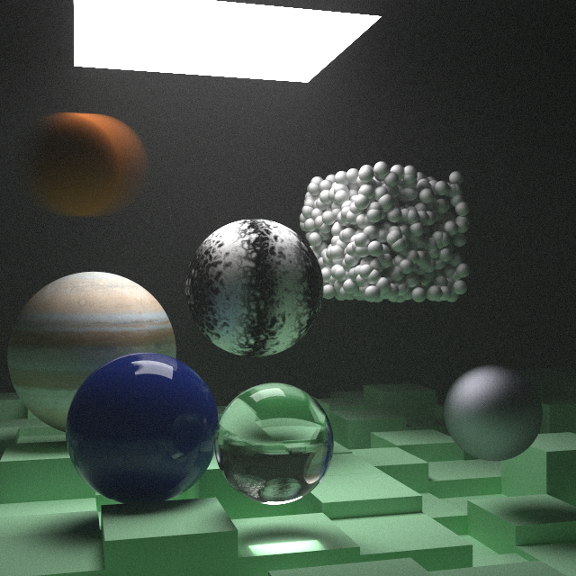

# rtnw-rs



and other results:
[cornellbox](./result/cornellbox.png "cornellbox")
[cornellsmoke](./result/cornellsmoke.png "cornellsmoke")
[marble](./result/marble.png "marble")
[litmarble](./result/litmarble.png "litmarble")
[randomscene](./result/randomscene.png "randomscene")

## What's this?

rtnw-rs is the next week ray tracer in Rust, which is following [@Peter_shirley](https://twitter.com/Peter_shirley)'s textbook.

## Usage

To get an image run:

```sh
cargo run --release
```

To show help run:

```sh
cargo run --release -- --help
```

## LICENSE

This software is released under the MIT License, see LICENSE.txt.

[2k_jupiter.jpg](./2k_jupiter.jpg "2k_jupiter.jpg") is distributed by [Solar System Scope](https://www.solarsystemscope.com/) under Attribution 4.0 International license.
